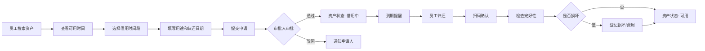

## 1. 产品概述

企业资产借用管理系统，解决公司电脑、投影仪、车辆等可复用资产的全生命周期管理问题，目标用户包括行政人员、部门员工和审批管理者，实现资产透明化、借用流程化、归还规范化。

## 2. 核心功能

### 2.1 用户角色

| 角色 | 注册方式 | 核心权限 |
|------|----------|----------|
| 普通员工 | 企业账号登录 | 搜索资产、查看可用时间、提交借用申请、查看个人借用记录 |
| 资产管理员 | 企业账号登录 + 权限配置 | 资产台账维护、状态管理、位置/责任人/附件配置、查看全部记录 |
| 审批人 | 企业账号登录 + 权限配置 | 批量审批申请、驳回申请、扫码归还确认、损坏登记、费用备注 |

### 2.2 功能模块

1. **资产台账**：资产列表、资产详情、增删改查、状态管理、附件管理
2. **借用申请**：资产搜索、可用时间查询、申请提交、用途说明、归还日期选择
3. **审批归还**：待审批列表、批量同意/驳回、扫码确认归还、损坏登记、费用记录
4. **日历看板**：资产占用日历、冲突检测、时间轴视图、预约状态可视化
5. **统计中心**：借用频次统计、逾期名单、闲置资产分析、部门使用排行

### 2.3 页面详情

| 页面名称 | 模块名称 | 功能描述 |
|---------|----------|----------|
| 资产台账 | 资产列表 | 支持多条件筛选（类型、状态、位置）、搜索、分页、批量操作 |
| 资产台账 | 资产卡片 | 展示资产图片、名称、编号、类型、状态、位置、责任人、借用记录 |
| 资产台账 | 资产表单 | 新增/编辑资产信息，支持附件上传（采购单、保修卡等） |
| 借用申请 | 资产搜索 | 关键词搜索、类型筛选、可用时间范围筛选 |
| 借用申请 | 可用时间 | 日历展示资产已占用时间段，选择借用起止时间 |
| 借用申请 | 申请提交 | 填写用途说明、紧急程度、附件上传（项目证明等） |
| 审批归还 | 审批列表 | 待办/已办分类，支持批量选择、同意/驳回操作 |
| 审批归还 | 归还处理 | 扫码识别资产、检查完整性、损坏等级选择、维修费用登记 |
| 日历看板 | 月/周视图 | 按日期展示所有资产借用状态，高亮冲突时间段 |
| 日历看板 | 资产筛选 | 按资产类型、部门、责任人筛选日历展示内容 |
| 统计中心 | 数据概览 | 资产总数、可用数、借用中数、逾期数、本月借用次数 |
| 统计中心 | 图表分析 | 借用频次趋势图、部门使用排行柱状图、资产类型分布饼图 |
| 统计中心 | 专项统计 | 逾期未还名单、闲置超过30天资产列表、损坏报修记录 |

## 3. 核心流程

### 3.1 借用流程
员工搜索资产 → 查看可用时间 → 选择借用时间段 → 填写用途和归还日期 → 提交申请 → 审批人审批 → 审批通过后资产状态更新为"借用中" → 到期提醒 → 员工归还 → 扫码确认 → 检查完好性 → 登记损坏/费用 → 资产状态更新为"可用"

### 3.2 资产管理流程
资产管理员登录 → 资产台账页面 → 新增/编辑资产信息 → 上传附件 → 设置状态/位置/责任人 → 保存 → 资产信息同步更新

## 4. 用户界面设计

### 4.1 设计风格

**设计方向**：企业级专业精致风格，采用商务深色主题配合科技蓝色点缀，打造专业、高效、可信赖的企业管理工具形象。

- **主色调**：深邃靛蓝 `#1e3a5f`，传达专业稳重
- **辅助色**：科技蓝 `#3b82f6` 用于按钮和关键操作；成功绿 `#10b981` 表示可用/通过；警示橙 `#f59e0b` 表示借用中；危险红 `#ef4444` 表示逾期/损坏
- **中性色**：深灰 `#1f2937` 背景、中灰 `#4b5563` 文本、浅灰 `#9ca3af` 辅助文本
- **字体**：标题使用 "Chillax" 现代无衬线字体，正文使用 "Inter" 提升可读性
- **按钮样式**：直角微方角 (border-radius: 6px)，扁平化设计，悬停时轻微上浮并伴随阴影加深
- **布局风格**：左侧固定导航 + 顶部工具栏 + 主体内容区的经典后台布局，卡片式信息分组
- **图标风格**：统一使用 Lucide 线性图标，保持简洁一致

### 4.2 页面设计概览

| 页面名称 | 模块名称 | UI元素 |
|---------|----------|--------|
| 资产台账 | 顶部工具栏 | 搜索框、类型筛选下拉、状态筛选标签、新增按钮 |
| 资产台账 | 资产列表 | 卡片网格布局，每个卡片包含缩略图、名称标签、状态徽章、快速操作按钮 |
| 资产台账 | 详情侧栏 | 从右侧滑入的半透明面板，展示完整信息和操作历史 |
| 借用申请 | 搜索区域 | 大型搜索框、标签式筛选器、时间范围选择器 |
| 借用申请 | 时间选择 | 交互式日历组件，已占用日期标红，可选日期高亮 |
| 借用申请 | 申请表单 | 分组表单，用途说明富文本输入，紧急程度滑块 |
| 审批归还 | 标签页导航 | 待审批/已审批/待归还/已归还 四个标签切换 |
| 审批归还 | 操作栏 | 全选复选框、批量同意按钮、批量驳回按钮、导出按钮 |
| 审批归还 | 归还弹窗 | 扫码动画、资产信息预览、损坏程度单选、费用输入框 |
| 日历看板 | 视图切换 | 月视图/周视图/列表视图切换按钮 |
| 日历看板 | 日历主体 | 时间块矩形，不同颜色代表不同状态，悬停显示详情气泡 |
| 日历看板 | 冲突提示 | 重叠时间块显示红色边框和冲突警告图标 |
| 统计中心 | 数据看板 | 顶部4个大型统计卡片，带渐变背景和图标装饰 |
| 统计中心 | 图表区域 | ECharts 图表，支持悬浮提示、点击钻取 |
| 统计中心 | 数据表格 | 斑马纹表格，支持排序、分页 |

### 4.3 响应式

采用桌面端优先设计，主要适配 1440px 和 1920px 宽度：
- 桌面端 (>1280px)：完整布局，左侧导航260px，右侧内容区自适应
- 平板端 (768px-1280px)：左侧导航可折叠为图标模式，内容区保持完整
- 移动端 (<768px)：底部Tab导航，日历切换为列表视图，表格改为卡片流

### 4.4 微交互与动画

- 页面加载：内容区从下往上渐入，各卡片依次延迟出现 (staggered animation)
- 按钮悬停：背景色渐变 + 轻微 translateY(-2px) + 阴影增强
- 状态变更：状态徽章颜色切换时伴随 0.3s 填充动画
- 侧栏滑入：从右侧 0 → 100% 滑入，背景遮罩透明度从 0 → 0.5
- 日历时间块：鼠标悬停时略微放大并显示详情 Tooltip
- 数据加载：骨架屏脉冲动画 (animate-pulse)
