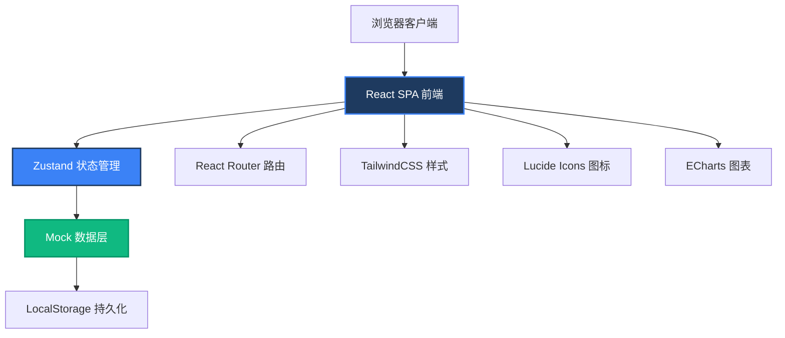
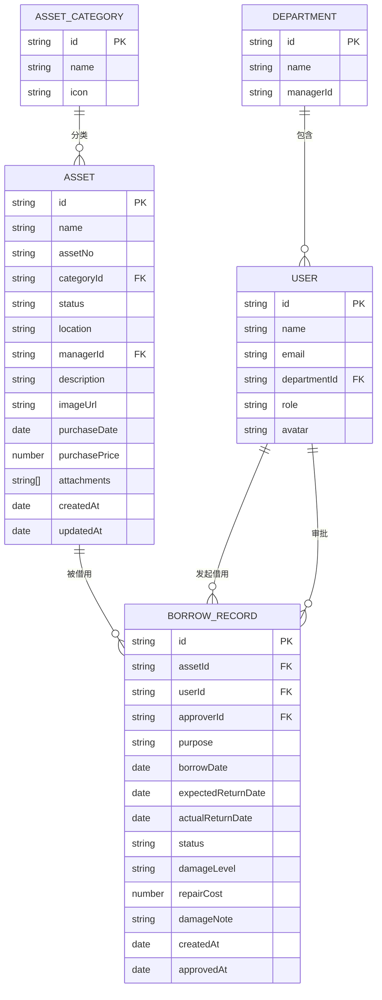

## 1. 架构设计



## 2. 技术描述

- **前端框架**：React 18 + TypeScript + Vite 5
- **状态管理**：Zustand 4，轻量级状态管理，支持中间件持久化
- **路由**：React Router Dom 6
- **样式方案**：TailwindCSS 3.4，自定义主题配置
- **UI 组件**：自研组件库，基于 Radix UI 原语
- **图标库**：Lucide React
- **图表库**：ECharts 5
- **日期处理**：date-fns 3
- **构建工具**：Vite 5
- **后端**：纯前端 Mock 数据，使用 LocalStorage 模拟持久化
- **数据存储**：LocalStorage 存储模拟数据

## 3. 目录结构

```
d:\trae-bz\TraeProjects\1021\
├── src\
│   ├── assets\           # 静态资源
│   ├── components\       # 通用组件
│   │   ├── Layout\       # 布局组件
│   │   ├── ui\           # 基础UI组件
│   │   └── charts\       # 图表组件
│   ├── pages\            # 页面组件
│   │   ├── AssetLedger\  # 资产台账
│   │   ├── BorrowApply\  # 借用申请
│   │   ├── Approval\     # 审批归还
│   │   ├── Calendar\     # 日历看板
│   │   └── Statistics\   # 统计中心
│   ├── store\            # Zustand 状态管理
│   ├── types\            # TypeScript 类型定义
│   ├── data\             # Mock 数据
│   ├── utils\            # 工具函数
│   ├── hooks\            # 自定义 Hooks
│   ├── App.tsx           # 主应用组件
│   ├── main.tsx          # 入口文件
│   └── index.css         # 全局样式
├── public\               # 公共资源
├── .trae\
│   └── documents\        # 项目文档
├── package.json
├── tsconfig.json
├── vite.config.ts
├── tailwind.config.js
└── postcss.config.js
```

## 4. 路由定义

| 路由路径 | 页面名称 | 访问角色 |
|---------|---------|----------|
| / | 重定向到 /assets | 所有 |
| /assets | 资产台账 | 所有登录用户 |
| /apply | 借用申请 | 员工、管理员 |
| /approval | 审批归还 | 审批人、管理员 |
| /calendar | 日历看板 | 所有登录用户 |
| /statistics | 统计中心 | 管理员、审批人 |

## 5. 数据模型

### 5.1 实体关系图



### 5.2 类型定义

```typescript
// 资产状态
type AssetStatus = 'available' | 'borrowed' | 'maintenance' | 'scrapped' | 'lost';

// 借用申请状态
type BorrowStatus = 'pending' | 'approved' | 'rejected' | 'returned' | 'overdue' | 'damaged';

// 用户角色
type UserRole = 'employee' | 'admin' | 'approver';

// 损坏程度
type DamageLevel = 'none' | 'minor' | 'moderate' | 'severe';

interface Asset {
  id: string;
  name: string;
  assetNo: string;
  categoryId: string;
  categoryName: string;
  status: AssetStatus;
  location: string;
  managerId: string;
  managerName: string;
  description: string;
  imageUrl: string;
  purchaseDate: string;
  purchasePrice: number;
  attachments: string[];
  createdAt: string;
  updatedAt: string;
}

interface BorrowRecord {
  id: string;
  assetId: string;
  assetName: string;
  assetNo: string;
  userId: string;
  userName: string;
  userDepartment: string;
  approverId: string;
  approverName: string;
  purpose: string;
  borrowDate: string;
  expectedReturnDate: string;
  actualReturnDate: string | null;
  status: BorrowStatus;
  damageLevel: DamageLevel;
  repairCost: number;
  damageNote: string;
  createdAt: string;
  approvedAt: string | null;
}

interface User {
  id: string;
  name: string;
  email: string;
  departmentId: string;
  departmentName: string;
  role: UserRole;
  avatar: string;
}

interface Department {
  id: string;
  name: string;
  managerId: string;
  employeeCount: number;
}

interface AssetCategory {
  id: string;
  name: string;
  icon: string;
}
```

## 6. 状态管理设计

### 6.1 Store 分层

```typescript
// 资产状态管理
interface AssetStore {
  assets: Asset[];
  categories: AssetCategory[];
  loading: boolean;
  fetchAssets: (filters?: AssetFilters) => Promise<void>;
  addAsset: (asset: Omit<Asset, 'id' | 'createdAt' | 'updatedAt'>) => void;
  updateAsset: (id: string, asset: Partial<Asset>) => void;
  deleteAsset: (id: string) => void;
  getAssetById: (id: string) => Asset | undefined;
}

// 借用状态管理
interface BorrowStore {
  records: BorrowRecord[];
  loading: boolean;
  fetchRecords: (filters?: BorrowFilters) => Promise<void>;
  createBorrowRequest: (data: CreateBorrowRequest) => void;
  approveBorrow: (ids: string[], note?: string) => void;
  rejectBorrow: (ids: string[], reason: string) => void;
  returnAsset: (id: string, data: ReturnAssetData) => void;
  getOverdueRecords: () => BorrowRecord[];
}

// 用户状态管理
interface UserStore {
  currentUser: User | null;
  users: User[];
  departments: Department[];
  login: (email: string) => void;
  logout: () => void;
  switchRole: (role: UserRole) => void;
}

// UI 状态管理
interface UIStore {
  sidebarCollapsed: boolean;
  currentPage: string;
  activeAssetId: string | null;
  showAssetDetail: boolean;
  showBorrowModal: boolean;
  showReturnModal: boolean;
  toggleSidebar: () => void;
  setCurrentPage: (page: string) => void;
  openAssetDetail: (id: string) => void;
  closeAssetDetail: () => void;
  openBorrowModal: (assetId: string) => void;
  closeBorrowModal: () => void;
  openReturnModal: (recordId: string) => void;
  closeReturnModal: () => void;
}
```

## 7. 核心组件设计

| 组件名称 | 路径 | 功能描述 |
|---------|------|----------|
| Sidebar | `components/Layout/Sidebar.tsx` | 左侧导航菜单，支持折叠 |
| Header | `components/Layout/Header.tsx` | 顶部栏，用户信息、角色切换 |
| PageContainer | `components/Layout/PageContainer.tsx` | 页面容器，统一样式 |
| DataTable | `components/ui/DataTable.tsx` | 通用数据表格，支持排序分页 |
| StatusBadge | `components/ui/StatusBadge.tsx` | 状态徽章，根据状态显示不同颜色 |
| AssetCard | `components/ui/AssetCard.tsx` | 资产卡片组件 |
| Modal | `components/ui/Modal.tsx` | 通用弹窗组件 |
| Button | `components/ui/Button.tsx` | 通用按钮组件 |
| Input | `components/ui/Input.tsx` | 通用输入框组件 |
| Select | `components/ui/Select.tsx` | 通用下拉选择组件 |
| DatePicker | `components/ui/DatePicker.tsx` | 日期选择组件 |
| CalendarGrid | `components/calendar/CalendarGrid.tsx` | 日历网格组件 |
| TimeBlock | `components/calendar/TimeBlock.tsx` | 时间块组件 |
| LineChart | `components/charts/LineChart.tsx` | 折线图封装 |
| BarChart | `components/charts/BarChart.tsx` | 柱状图封装 |
| PieChart | `components/charts/PieChart.tsx` | 饼图封装 |
| StatCard | `components/charts/StatCard.tsx` | 统计卡片组件 |

## 8. Mock 数据规模

- **资产数据**：50 条，覆盖笔记本电脑、投影仪、车辆、相机、音响等类型
- **借用记录**：80 条，包含待审批、已批准、已归还、逾期等各种状态
- **用户数据**：20 条，覆盖员工、管理员、审批人三种角色
- **部门数据**：6 条，技术部、市场部、销售部、行政部、财务部、人事部
- **资产分类**：8 条，电子设备、办公设备、交通工具、影音设备等
